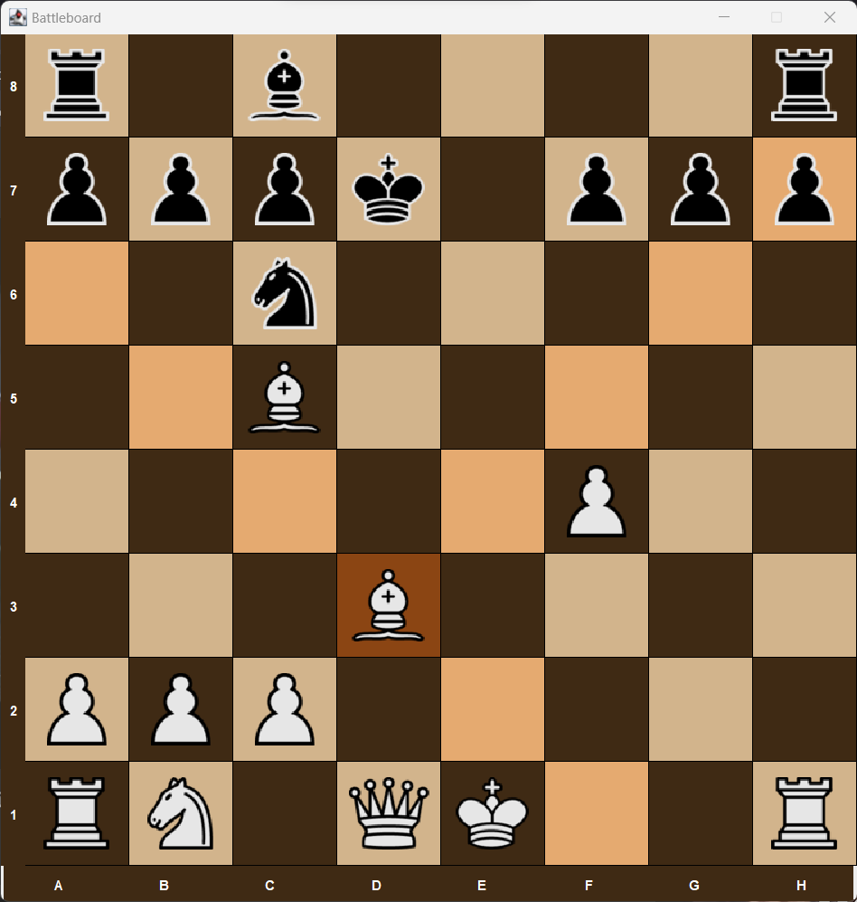
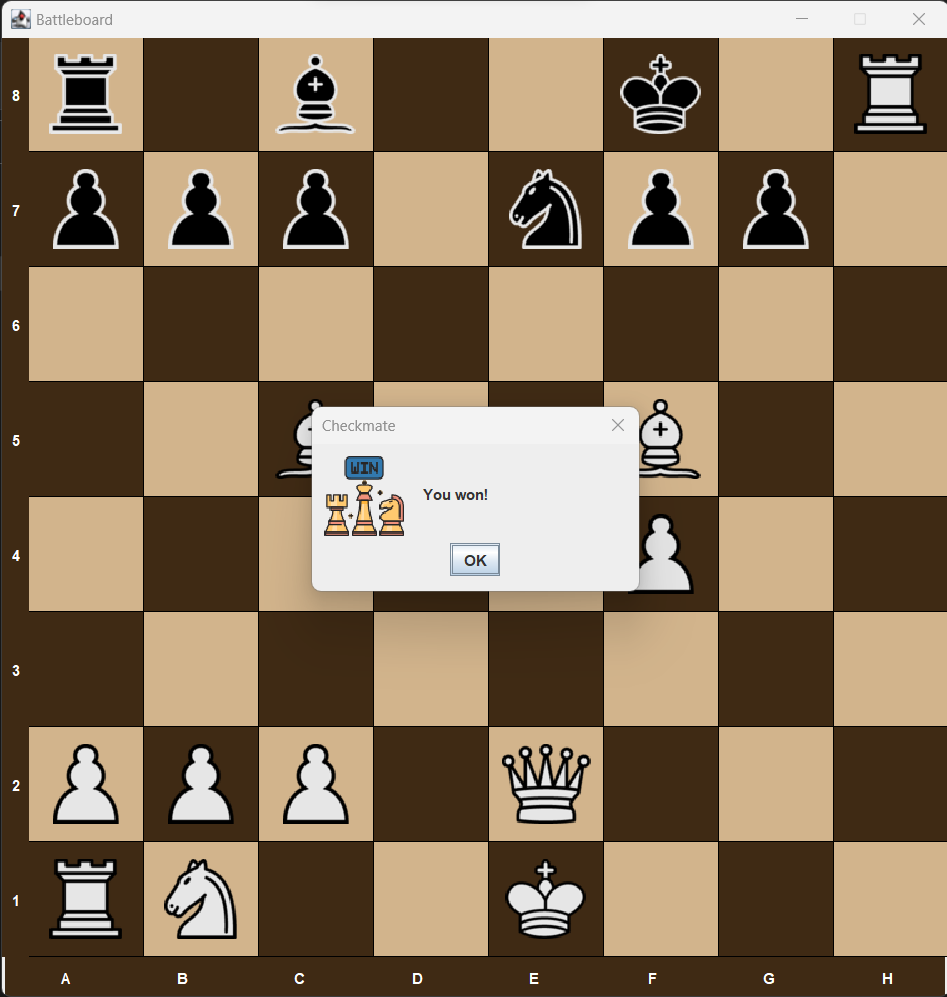

# Battleboard

A simple chess game that incorporates the minimax algorithm for its AI opponent. By simulating possible future moves and evaluating board positions, the AI strategically determines the best course of action, aiming to minimize its potential loss while maximizing its potential gain.

## Screenshots

